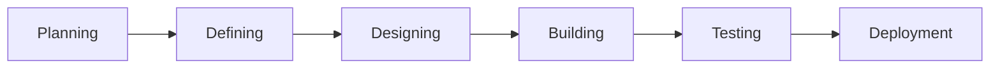
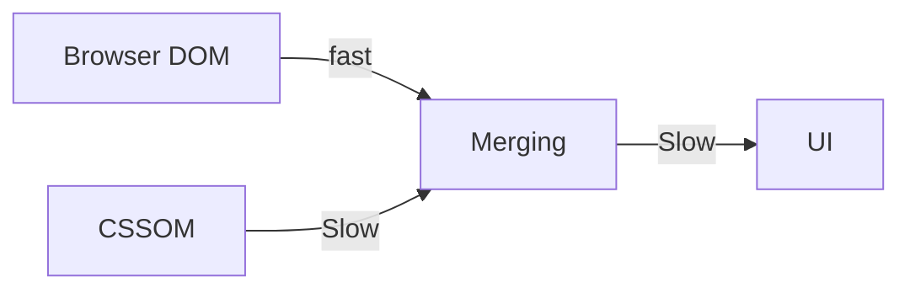

# CDP Batch 7 By Spring Rain

## Class 1
- HTML
- CSS
- Git

## Class 2
- JavaScript

## Class 3
- JavaScript
- Hoisted up of JS
- Array of JS
- - Push , Pop, Shift, Unshift 
- Deep copy and shallow copy
- Spread operator
- Slice and Splice
- Filter
- Doule equal and triple equal
- Reduce - sum of array
- foreach with array
- map with array
- DOM
- BOM
- - Window.location
- - Window.history
- - Window.navigator
- - Window.screen
-  browser local storage
-  browser session storage

## Class 4

- Callback
- Promise
- Async and Await
- Fetch API
- JSON
- Worker with JS

### Assignment
By clicking a button the worker will fetch data from jsonplaceholder and show the table data in the browser.
Use async and await , worker , callback.

## Class 5

- Folder structure
- GitHub Commit should be meaningful
- Git flow(Basically a framework for managing your branches)
- Clickup (Project management tool)
- Generative AI
- ZZZCODE.ai (Code generation tool)
- Github AUCorp(Github Account)
- Microservices vs Monolithic (Architecture)
- microservices.io ( A website for microservices)
- Serverless(Will be discussed in the next class)

## Class 6
### SDLC
The SDLC contains

Different types of SDLC
- Waterfall
- Agile
- Spiral

https://www.atlassian.com/agile
#### Agile
Client is always involved in the development process. It is a continuous process. It is a flexible process. It is a fast process. It is a cost-effective process.

Agile has four main point

- Individuals and interactions over processes and tools ( Discuss about what you did and what you are going to do and who is blocked for you)
- Working software over comprehensive documentation ( MVP first then add more features)
- Customer collaboration over contract negotiation
- Responding to change over following a plan

#### Sprint or Scrum
- Story point
- Overestimation

#### Kanban
- Always ready for new work

#### Iterative
- More like sprint
- Here work can be moved from one sprint to another sprint

### DevOps

It supports agile proces. It is a combination of development and operation.

- A CI/CD pipeline is maintained in DevOps.
- Integration works with sonarqube , unit test, code coverage, etc.

### Retrospective
Retrospective meeting disucss about what went wrong and what went right , what could be better . Retro meeting is done after every sprint.

### Six Sigma
- DMAIC (Define, Measure, Analyze, Improve, Control)
- DMADV (Define, Measure, Analyze, Design, Verify)

### Design Pattern

Refactoring Guru

- Creational
    - Factory Pattern
    - Singleton Pattern (Database connection)
- Structural
    - Adapter Pattern
- Behavioral
    - Chain of Responsibility

### DDD
#### An example of DDD
- Described an decomposed an real life application along with a discussion of why microservices are used.

- Circuit Breaker Pattern

### Pros and Cons of JS
- Functional Programming
- No strict type

## Class 7
- NODE
   - runtime environment
- NVM
- imperative vs declarative
    - imperative programming repeats code
    - declarative programming more like a function
- VDOM
    - copies the real DOM
    - compares the real DOM with the VDOM
    - updates the real DOM
    - only updates the part of the real DOM
- React compares in reconciliation
    - React will compare the VDOM with the real DOM
    - React will update the real DOM
    - React will only update the part of the real DOM
- CSSOM
    - CSS Object Model
- merging CSSOM and browser DOM is slow

- Why react?
    - Declarative
    - Reusable
    - One Way data flow / One Way binding
    - updates in batch
    - Effcient update of the DOM
- Why react is bad for SEO?
- Vite provides a faster development environment throught hot reload
- React Project Initialization With Vite
- Advantages of Component 
    - Fundamental building block
    - Reusability
    - Modularity
- Folder Structure of Boilerplate
- Details of JSX
    - Every tag must be closed or self-closed
    - Will return only one parent element
    - JSX transpiled to js(babel)
    - Class is replaced by className
    - Wrap js wi th {}
    - Is a syntax extension of JS

- Functional Component
- Class Component
    - State Management
    - Constructor
    - Render
    - Bind method

- State is Immutable
- Immer.js
## Class 8 
- LifeCycle Method
    - ComponentDidMount()
        - Called after the component is mounted for the first time
        - Making Network Request / api call / interect with DOM
    - shouldComponentUpdate()
        - return boolean Value(true/false)
        - called before rendering
        - unnecessary rendering can be avoided
        - optimization in performance
    - componentDidUpdate()
        - Called after the component is updated
    - componentWillUnmount()
        - Called before the component is removed from the DOM

## Class 14
### Class Work
Process
- Version 
- platform
- cpu usage

OS Module
- Cpu details
- Usage

FS Module
- file write

### Class topic
- Why Koa.js?
- Server using Koa.js
- Middleware

## Class 15
- https://www.w3resource.com/node.js/nodejs-programming-model.php
- Work with modules by making small functions
- HTTPS status code
- validator js
- JWT Token

## Class 16
- Koa router
- CORS (Cross-Origin Resource Sharing)
- CORS and Koa

## Class 17
- Router
- MVC Pattern
- Response Handler
- Error Handler
- Usage of Koa-Body package instead of body-parser

## Class 18
List of things to Install 
- DynamoDB local
- NoSQL workbench
- Docker Desktop
- LocalStack ( Github Repo - Gives More felxibility,Docker Image)  -> Gives Proper AWS Environment in Local Experience

SQL DB  Design Thinking Process
1. Relation
2. Normalization
3. Indexing
4. Query Optimization
5. Diamond Table (Intermediate Table between two tables)

SQL Works well with Monolithic Architecture . But creates problem with Scaling Issues and Horizonta Scaling is costly in SQL.

NO SQL DB Design Thinking Process
- Query Driven
- Write Heavy and Read simple  (Store as many relavant data as possible)
- LSI , GSI
    - LSI - Local Secondary Index
    - GSI - Global Secondary Index
- How data is stored in the engine

DaynamoDB
- NoSQL Database
- Works in Key-Value Pair
- DDB Key - PK - HashKey + SortKey /RangeKey(Composite Key)
- Supporing operation (scan[] , query[], get{} ,put  , batch write)
    - Scan - Get all the data from the table
    - Query - Get the data based on the key
    - Get - Get the data based on the key
    - Put - Insert the data
- Avoid Scanning as it is costly

Difference between MongoDB and DynamoDB
- MongoDB has incosistent data
- MongoDB connectivity issue and configuration with AWS

Financial Service -
- middleware - logger - error handler - response handler
- helper - arrayHelper
- utils - datePicker  , inputField  , jsonto Object
 - Model
    - Payment DB Call
    - all DB in model
- Controller
    - Payment business logic handle
    - handle model
    - no DB call in controller
- Service
    - Payment Service
        - 3rd party services call
        - Stripe
        - appex
        - account service
        - handle model

Frontend -> api GW -> AlB -> Service -> Queuing System -> Worker
                            Adpater                      Adapter

### Service
- Has a public api endpoint 
- It can be called by the frontend
- It will assign workers to do the job and it will be done in the background.

### Worker
- Worker has no connection with third party services.
- It works internally inside the VPS. 
- Worker can not call services . 
- Worker does all the heavy works.
- Worker can call other workers.

### Adapter
- Does outgoing calls to third party services.

tally 3rd api -

Initial setup

service1 -> tally

service2 -> tally

service3 -> tally

service4 -> tally

Adapter setup
service1 -> Adapter

service2 -> Adapter

service3 -> Adapter    --> tally1 ( Will call tally single time)

service4 -> Adapter

## Class 19
Code Was reviewed.
- Use query api for GSI (Global Secondary Index)